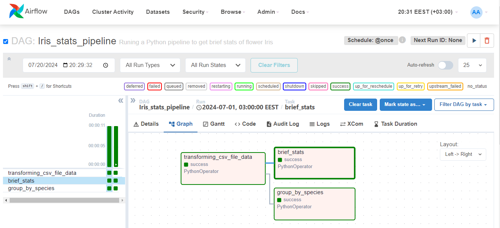

# Iris Data Processing using Pandas and Airflow

This repository contains the Airflow DAG for orchestrating the analysis of the Iris flower dataset using Pandas.
Dataset has been taken from [Kaggle](https://www.kaggle.com/datasets/arshid/iris-flower-dataset?resource=download).

**Functionality:**

* Removes null values from the CSV data.
* Calculates basic statistics (count, mean, min, max) for all flower species.
* Groups data by species and calculates statistics for each group.

**Technologies:**

* Airflow
* Python
* Pandas

**Setup and Requirements:**

1. Install Airflow and its dependencies (refer to Airflow documentation for specific versions).
2. Ensure you have Pandas installed (`pip install pandas`).
3. (Optional) Configure file paths in the code if not using relative paths.

**Running the DAG:**

1. Set up your Airflow environment and web server (refer to Airflow documentation).
2. Trigger the DAG manually or through Airflow's scheduler (details in Airflow UI).

**Screenshots from Airflow UI**

